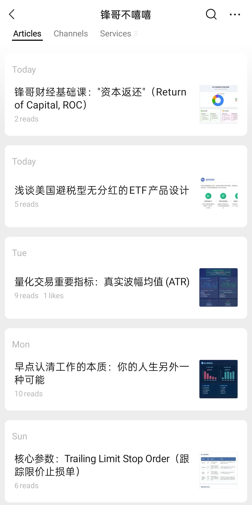
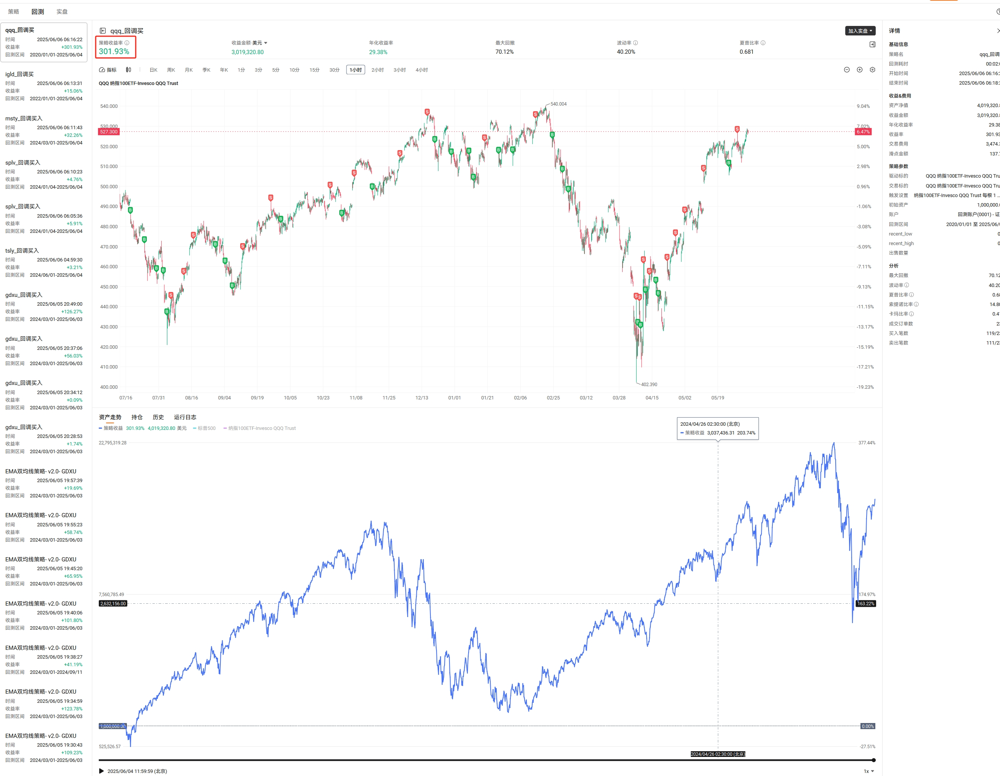
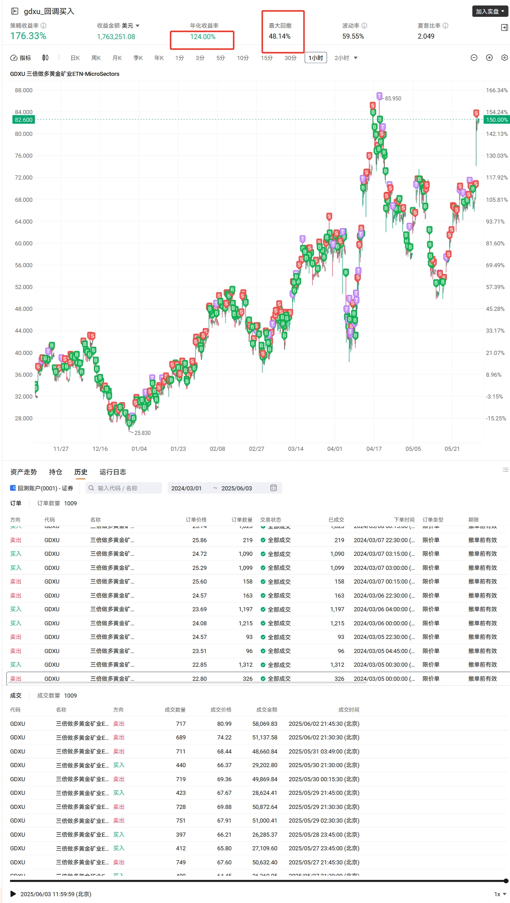
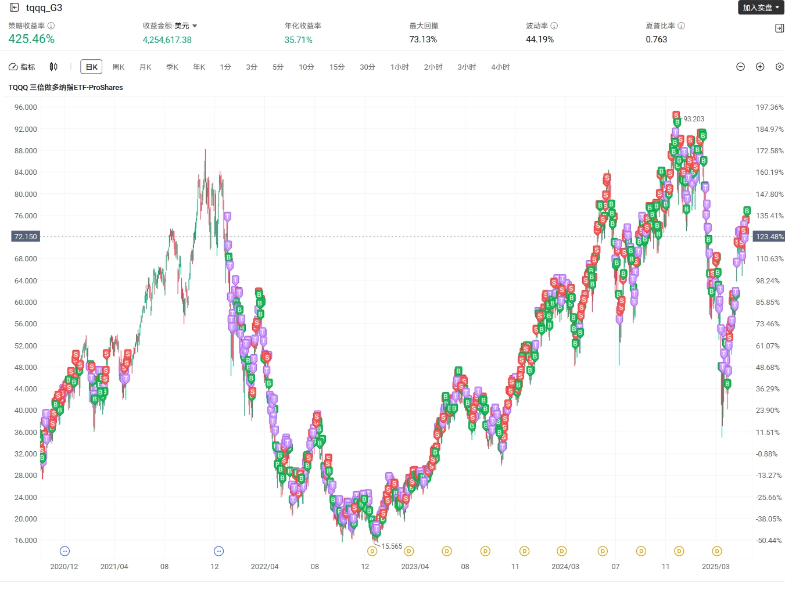
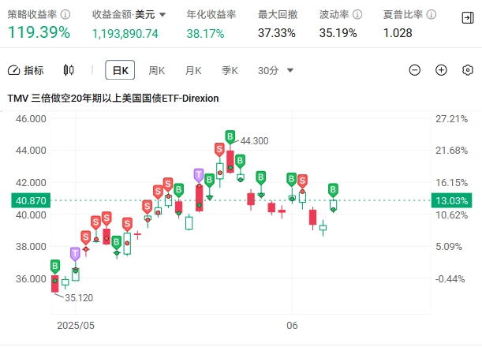

# 只是各种量化代码

## 延伸阅读

锋哥公众号，分享量化和投资的干货文章，介绍投资经验。全免费分享。

## 免责声明

本项目，完全出于娱乐目的，所有算法，均为了搞笑而生成，纯属于胡乱拼接而成。

只能用于划水摸鱼，请大家注意识别。

问就是没有实盘，全部在亏钱。没有任何价值，完全都是错误的。你们直接划走，不要往下看。

## 算法列表

### [QQQ 回调策略](./qqq_v1/)

### [GDXU 回调策略](./gdxu_v1/)

### [TQQQ G3](./tqqq_g3/)

### [TMV G3](./tmv_g3/)

## 致谢

如果您觉得本项目有用，打赏或者转发，以及支持，都是非常欢迎的。

您的支持，将支持作者持续更新和改进算法。

## 关于作者

锋哥话财经， 一个财经自媒体博主。欢迎关注我的Youtube和Tiktok频道以及X。

* [Youtube锋哥话财经](https://www.youtube.com/@windlifes)
* [Tiktok锋哥话财经](https://www.tiktok.com/@windlifes)
* [X锋哥话财经](https://x.com/windlifes)
